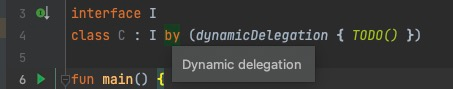

# kotlin-dynamic-delegation

Kotlin compiler plugin that allows class delegation to be dynamic like property delegations.

## Features

### Dynamic Delegations

The plugin provides:

```kotlin
public fun <R> dynamicDelegation(value: () -> R): R =
    throw NotImplementedError("Implemented as intrinsic")
```

This function is implemented by the compiler. Here is an example.

Suppose this is your existing code and is published to the public:

```kotlin
interface CommandManager {
    val commands: List<Command>
    fun register(command: Command)

    companion object : CommandManager {
        // implement CommandManager
    }
}
```

Suppose then you realized the CommandManager instance should be static (statically initialized or singleton).
You changed the CommandManager to this because you cannot remove code that have been published to the public:

```kotlin
interface CommandManager {
    val commands: List<Command>
    fun register(command: Command)

    companion object : CommandManager {
        private val instance by lazy { CommandManagerImpl() }

        // You must manually delegate all calls to instance
        override val commands: List<Command> get() = instance.commands
        override fun register(command: Command): Unit = instance.register(command)
    }
}
```

Now with Kotlin Dynamic Delegation, you can do instead:

```kotlin
interface CommandManager {
    val commands: List<Command>
    fun register(command: Command)

    companion object : CommandManager by (dynamicDelegation(Companion::instance)) {
        private val instance by lazy { CommandManagerImpl() }

        // All delegates will be generated automatically
    }
}
```

Alternatively, it's also possible to do this:

```kotlin
interface CommandManager {
    val commands: List<Command>
    fun register(command: Command)

    companion object : CommandManager by (dynamicDelegation { getCommandManagerImpl() }) {
        // All delegates will be generated automatically
    }
}

private fun getCommandManagerImpl(): CommandManager {
    // This is called to get actual CommandManager instance when a member inside CommandManager.Companion is called.

    if (!someChecks()) {
        error("It's not the time to call CommandManager!")
    }
    if (someOtherChecks()) {
        currentInstance = CommandManagerImpl() // Possible to update delegated instance
    }
    return currentInstance
}
private var currentInstance: CommandManager = CommandManagerImpl()
```

### Using Lazy In Functions

Functions can also be 'lazy' by making a value lazy and persistent.

```kotlin
override fun toString(): String = persistent { this.joinToString() } // initialize lazily once and use afterwards.
```

is the same as

```kotlin
private val toStringTemp by lazy { this.joinToString() }
override fun toString(): String = toStringTemp
```

## Using the plugin

build.gradle.kts

```kotlin
plugins {
    id("me.him188.kotlin-dynamic-delegation") version "VERSION"
}
```

You also need to add a 'compileOnly' dependency 'me.him188:kotlin-dynamic-delegation-runtime':

For JVM projects:

```kotlin
dependencies {
    implementation("me.him188:kotlin-dynamic-delegation:VERSION")
}
```

For MPP, adding to `commonMain` would automatically add for all targets:

```kotlin
kotlin.sourceSets {
    commonMain {
        dependencies {
            implementation("me.him188:kotlin-dynamic-delegation:VERSION")
        }
    }
}
```

See VERSION from [releases](https://github.com/Him188/kotlin-dynamic-delegation/releases)

## Installing IntelliJ IDEA plugin

IDEA plugin can help to edit code and to report errors before compiling the code. By seeing the type cast hint(see
picture below), you will know, without compiling, that your code with dynamic delegations will work.

Plugin Marketplace Page: https://plugins.jetbrains.com/plugin/18219-kotlin-dynamic-delegation

